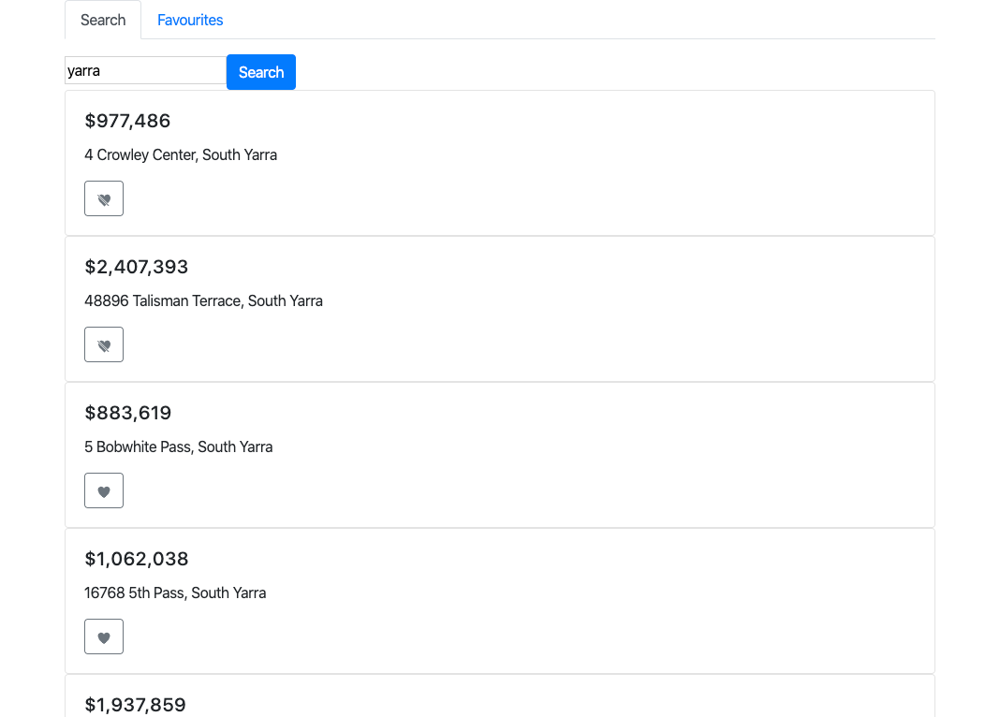
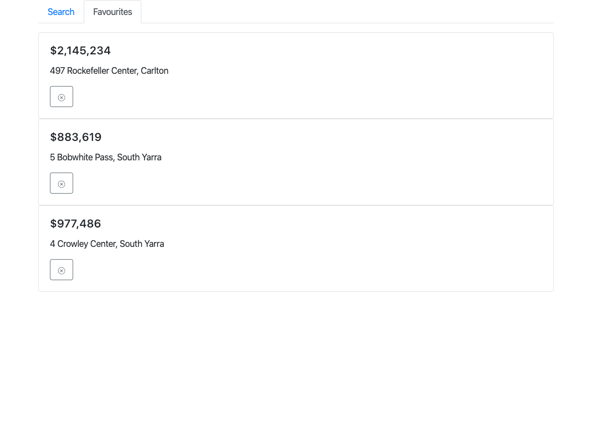

# REA clone

[](https://github.com/chrischenyc/rea-clone/actions?query=workflow%3A%22Server+CI%22)
[](https://github.com/chrischenyc/rea-clone/actions?query=workflow%3A%22Web+CI%22)

## Tech-stack decisions

Javascript, React, Node.js, GraphQL based on current team skills.

Typescript would play nicely when it comes to server-side GraphQL [types/resolvers/queries/mutations generation](https://typegraphql.com/), and even better with client-side [schema/hooks code generation](https://graphql-code-generator.com/), but that's another story.

- React web app

  - standard [CRA](https://reactjs.org/docs/create-a-new-react-app.html) project. It would be nice to use [Next.js](https://nextjs.org/) in production, however, server-side-rendering is not current concern, so meh.
  - Prefer functional component over class component.
  - Practise [smart component vs dumb component](https://medium.com/@dan_abramov/smart-and-dumb-components-7ca2f9a7c7d0) pattern to separate presentational concerns from business logic.
  - React [Context](https://reactjs.org/docs/context.html) will be used to manage state, with local storage as the client-side data persistence mechanism.
  - [Apollo React Hooks](https://www.apollographql.com/docs/react/api/react-hooks/https://www.apollographql.com/docs/react/api/react-hooks/) will be used to execute GraphQL queries.
  - Use cypress.io for e2e testing

- Node.js back-end

  - standard express.js project, with [Apollo express server](https://github.com/apollographql/apollo-server/tree/master/packages/apollo-server-express) configuration.
  - [role-base project structure](https://hackernoon.com/three-ways-to-structure-your-graphql-code-with-apollo-server-4788beed89db), I am also open to domain-based project structure.
  - The search query is agnostic to the underlying data system (database, cache, external web service, mock JSON file), therefore, a layer of abstraction is necessary to modularise searching functions.

## Get started with node.js server

```bash
// start server on http://localhost:4000

cd server
yarn
yarn dev

// run unit tests
yarn test
```

## Get started with React web app

```bash
// start server on http://localhost:3000

cd web
yarn
yarn dev

// run unit tests
yarn test

// run e2e tests
yarn test:e2e

// run e2e tests in chrome browser
yarn test:e2e:chrome
//
```

## TODO

due to time constraint, some tasks are left unfinished:

- infrastructure: terraform (or cloudformation) scripts to provision AWS S3 bucket, CloudFront, EC2, auto scaling group, and loading balancer.
- front-end CD: aws cli to upload react build bundle to S3 bucket, purge CloudFront cache
- back-end CD: dockerize node.js container, publish, and deploy, either through AWS Elastic Beanstalk, or k8s/helm
- front-end e2e CI: once we've done the front-end and back-end deployment, the cypress e2e can be configured to run as part of the CI
- missing front-end e2e test cases: add/remove properties to favourites, local user state persistence after refresh, etc

## Screenshots



